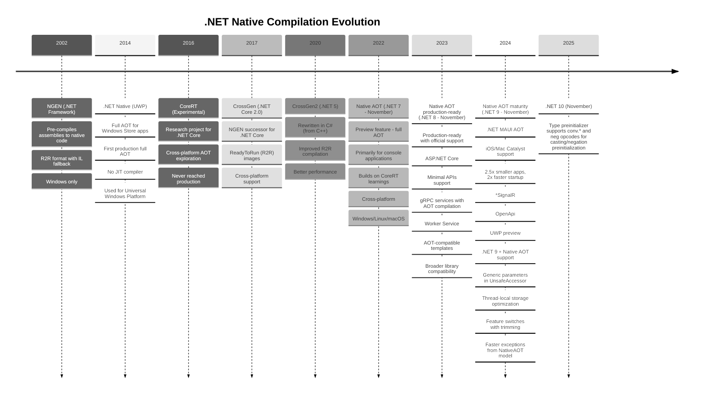

# Native AOT vs Standard Minimal APIs

## Overview
This repository compares two ASP.NET Core Minimal API implementations targeting .NET 9: a standard JIT-compiled build and a Native AOT-compiled build. It also includes a Spring Boot GraalVM sample for cross-platform benchmarking. The focus is on evaluating cold start, throughput, and memory usage characteristics across runtimes.

## Architecture at a Glance
```text
native-aot-sm/
├── AotMinimalApi/            # ASP.NET Core Minimal API compiled with Native AOT
├── StandardMinimalApi/       # Baseline ASP.NET Core Minimal API running on the JIT
├── SpringBootGraalVM/        # Optional Java Spring Boot service compiled with GraalVM native-image
├── build-and-run.ps1         # End-to-end publish and execution helper for Windows/PowerShell
├── compare-performance.ps1   # Automated latency, CPU, and memory benchmark harness
├── monitor-memory.ps1        # Live memory/CPU monitor for the running services
├── test-cold-start.ps1       # Cold start measurement script across runtimes
├── run-apis.(bat|ps1)        # Start previously published services without rebuilding
├── start-aot.bat             # Convenience launcher for the Native AOT binary
├── start-standard.bat        # Convenience launcher for the JIT-based API
└── timeline.mmd              # Mermaid timeline describing .NET native compilation history
```

## Technology Stack
- **Framework:** ASP.NET Core Minimal APIs targeting **.NET 9** for both the standard and Native AOT projects.【F:AotMinimalApi/AotMinimalApi.csproj†L1-L42】【F:StandardMinimalApi/StandardMinimalApi.csproj†L1-L23】
- **Serialization:** System.Text.Json source generators pre-warm Native AOT serialization metadata.【F:AotMinimalApi/Program.cs†L1-L28】
- **Optional JVM Sample:** Spring Boot application compiled with GraalVM native-image for comparative testing (see `SpringBootGraalVM`).

## HTTP Endpoints
Both Minimal API projects expose identical routes to simplify comparisons:
- `GET /users` – Returns 10,000 synthetic user records with nested profile data for JSON serialization load testing.【F:AotMinimalApi/Program.cs†L32-L135】【F:StandardMinimalApi/Program.cs†L9-L92】
- `GET /benchmark` – Executes a CPU-intensive prime calculation loop and returns diagnostic metadata (including the process ID for telemetry scripts).【F:AotMinimalApi/Program.cs†L137-L180】【F:StandardMinimalApi/Program.cs†L94-L139】

## Build, Run, and Benchmark Scripts
| Script | Purpose |
| --- | --- |
| `build-and-run.ps1` | Publishes one or both Minimal API projects (standard or Native AOT) and optionally launches them on ports 5000/5001. Supports build-only or run-only workflows and highlights published endpoints for quick validation.【F:build-and-run.ps1†L1-L162】 |
| `run-apis.ps1` / `run-apis.bat` | Boots previously published binaries without rebuilding, detaching them so they continue running independently of the shell session.【F:run-apis.ps1†L1-L74】 |
| `start-standard.bat` & `start-aot.bat` | Minimal wrappers generated during publish that launch the JIT (`dotnet`) or AOT (`AotMinimalApi.exe`) binaries with the correct URLs.【F:run-apis.ps1†L38-L68】 |
| `compare-performance.ps1` | Comprehensive benchmarking harness that exercises `/users` and `/benchmark` endpoints across the .NET JIT, Native AOT, and optional GraalVM services. Collects response-time statistics and memory usage for each run.【F:compare-performance.ps1†L1-L212】 |
| `monitor-memory.ps1` | Continuously samples working set, private memory, CPU time, and thread counts for each running service to visualize resource utilization trends.【F:monitor-memory.ps1†L1-L46】 |
| `test-cold-start.ps1` | Measures cold start timings across multiple iterations for the .NET JIT, Native AOT, and GraalVM binaries, triggering rebuilds when required to ensure accurate comparison.【F:test-cold-start.ps1†L1-L55】 |

## Native AOT Timeline
The repository includes a Mermaid timeline summarizing milestones in .NET native compilation. View it directly below or open [`timeline.mmd`](timeline.mmd).



## Next Steps
1. `pwsh ./build-and-run.ps1` – Publish both Minimal APIs and choose which binaries to execute.
2. Exercise the `/users` and `/benchmark` endpoints to validate functionality and collect baseline metrics.
3. Use `compare-performance.ps1`, `monitor-memory.ps1`, or `test-cold-start.ps1` to gather deeper insights for documentation or presentations.

## Contributing
Issues and pull requests that expand the benchmark suite, add new runtime targets, or improve documentation are welcome.
